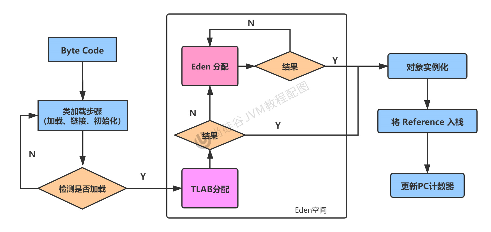

## 1、堆的核心概述

1. 堆针对一个JVM进程来说是唯一的。也就是**一个进程只有一个JVM实例**，一个JVM实例中就有一个运行时数据区，一个运行时数据区只有一个堆和一个方法区。
2. 但是**进程包含多个线程，他们是共享同一堆空间的**。
3. 一个JVM实例只存在一个堆内存，堆也是Java内存管理的核心区域。
4. Java堆区在JVM启动的时候即被创建，其空间大小也就确定了，堆是JVM管理的最大一块内存空间，并且堆内存的大小是可以调节的。
5. 《Java虚拟机规范》规定，堆可以处于物理上不连续的内存空间中，但在逻辑上它应该被视为连续的。
6. 所有的线程共享Java堆，在这里还可以划分线程私有的缓冲区（Thread Local Allocation Buffer，**TLAB**）。
7. 《Java虚拟机规范》中对Java堆的描述是：**所有的对象实例以及数组都应当在运行时分配在堆上**。（The heap is the run-time data area from which memory for all class instances and arrays is allocated）
   - 从实际使用角度看：“几乎”所有的对象实例都在堆分配内存，但并非全部。因为还有一些对象是在栈上分配的（逃逸分析，标量替换）
8. 数组和对象可能永远不会存储在栈上（**不一定**），因为栈帧中保存引用，这个引用指向对象或者数组在堆中的位置。
9. 在方法结束后，堆中的对象不会马上被移除，仅仅在垃圾收集的时候才会被移除。
   - 也就是触发了GC的时候，才会进行回收
   - 如果堆中对象马上被回收，那么用户线程就会收到影响，因为有stop the word
10. 堆，是GC（Garbage Collection，垃圾收集器）执行垃圾回收的重点区域。

> 随着JVM的迭代升级，原来一些绝对的事情，在后续版本中也开始有了特例，变的不再那么绝对。

```java
public class SimpleHeap {
    private int id;//属性、成员变量

    public SimpleHeap(int id) {
        this.id = id;
    }

    public static void main(String[] args) {
        SimpleHeap sl = new SimpleHeap(1);
        SimpleHeap s2 = new SimpleHeap(2);
    }
}

```


## 2、堆的内存细分


如图所示，在Java7及之前堆内存逻辑上分为三部分：新生代+老年代+永久代，而在Java8以及之后，永久代被替换成了元空间。

### 2.1 设置堆内存大小

1. Java堆区用于存储Java对象实例，那么堆的大小在JVM启动时就已经设定好了，大家可以通过选项"-Xms"和"-Xmx"来进行设置。
   - **-Xms**用于表示堆区的起始内存，等价于**-XX:InitialHeapSize**
   - **-Xmx**则用于表示堆区的最大内存，等价于**-XX:MaxHeapSize**
2. 一旦堆区中的内存大小超过“-Xmx"所指定的最大内存时，将会抛出OutofMemoryError异常。
3. 通常会将-Xms和-Xmx两个参数配置相同的值

- 原因：假设两个不一样，初始内存小，最大内存大。在运行期间如果堆内存不够用了，会一直扩容直到最大内存。如果内存够用且多了，也会不断的缩容释放。频繁的扩容和释放造成不必要的压力，避免在GC之后调整堆内存给服务器带来压力。
- 如果两个设置一样的就少了频繁扩容和缩容的步骤。内存不够了就直接报OOM

1. 默认情况下:
   - 初始内存大小：物理电脑内存大小/64
   - 最大内存大小：物理电脑内存大小/4

如果我们给我们的程序设置xms和xmx都是600m，但是通过Java代码：

` Runtime.getRuntime().totalMemory()/1024/1024`

得到Java虚拟机中的堆内存总量发现，只有575m，比预计的少了25m，那是因为我们堆的S0和S1区只有一个能用，这是由于垃圾回收的需要导致的。

### 2.2 新生代和老年代


1. 一般来说，新生代和老年代的大小比例为1：2，而新生代里面的Eden：S0：S1=8：1：1
   - **-XX:NewRatio**=4，表示新生代占1，老年代占4，新生代占整个堆的1/5
   - **-XX:SurvivorRatio=8**，调整新生代内部结构空间比例
2. **几乎所有的Java对象都是在Eden区被new出来的**
3. 绝大部分的Java对象的销毁都在新生代进行了（有些大的对象在Eden区无法存储时候，将直接进入老年代），IBM公司的专门研究表明，新生代中80%的对象都是“朝生夕死”的。
4. 可以使用选项"-Xmn"设置新生代最大内存大小，但这个参数一般使用默认值就可以了。

### 2.3 一般情况下的对象分配

1. 我们创建的对象，一般都是放在Eden区的，**当我们Eden区满了之后，就会触发GC操作**，此时的GC操作一般称为YGC/Minor GC
2. 当YGC开始的时候，在Eden区过期的对象会被回收，然后没有过期的话就会存放在S0区。同时我们会给每一个对象都设置了一个年龄计数器，如果经过一次YGC之后还没有被回收，就会加1。
3. 如果年龄计数器到达了15次，就可以进入老年代，可以通过JVM参数设置：**-XX:MaxTenuringThreshold**=N。
4. 同时Eden继续存放对象，当Eden再次满的时候，就会触发YGC操作，此时YGC会将Eden和S0都进行一次垃圾回收，并且将存活的对象放入S1区，然后年龄计数器+1。此时S0区是空的，再下一次垃圾回收的时候，会将存活的对象放入S0区，然后清空S1，以此循环
5. 如果经过不停的对象生成和垃圾回收，当新生代中的对象的年龄计数器到达15次之后，会触发一次Promotion晋升的操作，将该对象晋升到老年代里面。

### 2.4 特殊情况下的对象分配

1. 如果来了一个新对象，要先看Eden区是否放得下
   - 如果放得下，就直接放到Eden区
   - 如果放不下，就触发YGC，执行垃圾回收，再看能否放进去
2. 如果Eden执行了YGC后还是放不到Eden区，就只能看老年代能否放进去，如果老年代也放不进就 进行一次FGC。如果这个时候还是放不下，就只能报OOM错误了
3. 如果Eden区满了之后触发YGC，将对象放入S0或者S1，但是发现也放不下，就只能晋升至老年代了


## 3、GC分类

1. 我们都知道，JVM的调优的一个环节，也就是垃圾收集，我们需要尽量的避免垃圾回收，因为在垃圾回收的过程中，容易出现STW（Stop the World）的问题，**而 Major GC 和 Full GC出现STW的时间，是Minor GC的10倍以上**
2. JVM在进行GC时，并非每次都对上面三个内存区域一起回收的，大部分时候回收的都是指新生代。针对Hotspot VM的实现，它里面的GC按照回收区域又分为两大种类型：一种是部分收集（Partial GC），一种是整堆收集（FullGC）

- 部分收集：不是完整收集整个Java堆的垃圾收集。其中又分为：
  - **新生代收集**（Minor GC/Young GC）：只是新生代（Eden，s0，s1）的垃圾收集
  - **老年代收集**（Major GC/Old GC）：只是老年代的圾收集。
  - 目前，只有CMS GC会有单独收集老年代的行为。
  - 注意，很多时候Major GC会和Full GC混淆使用，需要具体分辨是老年代回收还是整堆回收。
  - 混合收集（Mixed GC）：收集整个新生代以及部分老年代的垃圾收集。目前，只有G1 GC会有这种行为
- **整堆收集**（Full GC）：收集整个java堆和方法区的垃圾收集。

> 由于历史原因，外界各种解读，majorGC和Full GC有些混淆。

### 3.1 YoungGC

1. 当年轻代空间不足时，就会触发Minor GC，这里的年轻代满指的是Eden代满。Survivor满不会主动引发GC，在Eden区满的时候，会顺带触发s0区的GC，也就是被动触发GC（每次Minor GC会清理年轻代的内存）
2. 因为Java对象大多都具备朝生夕灭的特性，所以Minor GC非常频繁，一般回收速度也比较快。
3. Minor GC会引发STW（Stop The World），暂停其它用户的线程，等垃圾回收结束，用户线程才恢复运行

### 3.2 Major/Full GC

**老年代GC（MajorGC）触发机制**

1. 指发生在老年代的GC，对象从老年代消失时，我们说 “Major Gc” 或 “Full GC” 发生了
2. 出现了MajorGc，经常会伴随至少一次的Minor GC。（但非绝对的，在Parallel Scavenge收集器的收集策略里就有直接进行MajorGC的策略选择过程）
   - 也就是在老年代空间不足时，会先尝试触发Minor GC，如果之后空间还不足，则触发Major GC
3. Major GC的速度一般会比Minor GC慢10倍以上，STW的时间更长。
4. 如果Major GC后，内存还不足，就报OOM了

**Full GC 触发机制（后面细讲）**

**触发Full GC执行的情况有如下五种：**

1. 调用System.gc()时，系统建议执行FullGC，但是不必然执行
2. 老年代空间不足
3. 方法区空间不足
4. 通过Minor GC后进入老年代的平均大小大于老年代的可用内存
5. 由Eden区、survivor space0（From Space）区向survivor space1（To Space）区复制时，对象大小大于To Space可用内存，则把该对象转存到老年代，且老年代的可用内存小于该对象大小

说明：Full GC 是开发或调优中尽量要避免的。这样STW时间会短一些

## 4、堆空间分代思想

**分代的原因和作用**

1. 优化GC性能
2. 如果没有分代的话，就相当于将一个学校的人都关在一个教室里面，不方便管理。GC的时候如果要找到哪些对象没用，这样就会对堆内所有区域进行扫描，导致性能低下
3. 据研究表明，很多对象都是朝生夕死的，如果分代的话，将新创建的对象放到某一个地方，当GC的时候优先将这块区域进行回收，就会腾出很大的空间来。（多回收新生代，少回收老年代，这样能提升很多性能)。

## 5、对象内存分配策略

1. 如果对象在Eden出生并经过第一次Minor GC后仍然存活，并且能被Survivor容纳的话，将被移动到Survivor空间中，并将对象年龄设为1。
2. 对象在Survivor区中每熬过一次MinorGC，年龄就增加1岁，当它的年龄增加到一定程度（默认为15岁，其实每个JVM、每个GC都有所不同）时，就会被晋升到老年代
3. 对象晋升老年代的年龄阀值，可以通过选项**-XX:MaxTenuringThreshold**来设置

**针对不同年龄段的对象分配原则如下所示：**

1. **优先分配到Eden**：开发中比较长的字符串或者数组，会直接存在老年代，但是因为新创建的对象都是朝生夕死的，所以这个大对象可能也很快被回收，但是因为老年代触发Major GC的次数比 Minor GC要更少，因此可能回收起来就会比较慢
2. **大对象直接分配到老年代**：尽量避免程序中出现过多的大对象
3. **长期存活的对象分配到老年代**
4. **动态对象年龄判断**：如果Survivor区中相同年龄的所有对象大小的总和大于Survivor空间的一半，年龄大于或等于该年龄的对象可以直接进入老年代，无须等到MaxTenuringThreshold中要求的年龄。
5. **空间分配担保**： -XX:HandlePromotionFailure 。

## 6、TLAB（Thread Local Allocation Buffer）

1. 堆区是线程共享区域，任何线程都可以访问到堆区中的共享数据
2. 由于对象实例的创建在JVM中非常频繁，因此在并发环境下从堆区中划分内存空间是线程不安全的
3. 为避免多个线程操作同一地址，需要使用**加锁等机制**，进而影响分配速度。


1. 从内存模型而不是垃圾收集的角度，对Eden区域继续进行划分，**JVM为每个线程分配了一个私有缓存区域，它包含在Eden空间内**。
2. 多线程同时分配内存时，使用TLAB可以避免一系列的非线程安全问题，同时还能够提升内存分配的吞吐量，因此我们可以将这种内存分配方式称之为**快速分配策略**。
3. 据我所知所有OpenJDK衍生出来的JVM都提供了TLAB的设计。

> TLAB只是让每个线程有私有的分配指针，但底下存对象的内存空间还是给所有线程访问的，只是其它线程无法在这个区域分配而已。


**TLAB再说明**

1. 尽管不是所有的对象实例都能够在TLAB中成功分配内存，但**JVM确实是将TLAB作为内存分配的首选**。
2. 在程序中，开发人员可以通过选项“**-XX:UseTLAB**”设置是否开启TLAB空间。
3. 默认情况下，TLAB空间的内存非常小，仅占有整个Eden空间的1%，当然我们可以通过选项“**-XX:TLABWasteTargetPercent**”设置TLAB空间所占用Eden空间的百分比大小。
4. 一旦对象在TLAB空间分配内存失败时，JVM就会尝试着通过**使用加锁机制确保数据操作的原子性**，从而直接在Eden空间中分配内存。



## 7、堆空间常用参数设置

```java
/**
 * 测试堆空间常用的jvm参数：
 * -XX:+PrintFlagsInitial : 查看所有的参数的默认初始值
 * -XX:+PrintFlagsFinal  ：查看所有的参数的最终值（可能会存在修改，不再是初始值）
 *      具体查看某个参数的指令： jps：查看当前运行中的进程
 *                             jinfo -flag SurvivorRatio 进程id
 *
 * -Xms：初始堆空间内存 （默认为物理内存的1/64）
 * -Xmx：最大堆空间内存（默认为物理内存的1/4）
 * -Xmn：设置新生代的大小。(初始值及最大值)
 * -XX:NewRatio：配置新生代与老年代在堆结构的占比
 * -XX:SurvivorRatio：设置新生代中Eden和S0/S1空间的比例
 * -XX:MaxTenuringThreshold：设置新生代垃圾的最大年龄
 * -XX:+PrintGCDetails：输出详细的GC处理日志
 * 打印gc简要信息：① -XX:+PrintGC   ② -verbose:gc
 * -XX:HandlePromotionFailure：是否设置空间分配担保
 */
```

## 8、空间分配担保

1、在发生Minor GC之前，虚拟机会检查老年代最大可用的连续空间是否大于新生代所有对象的总空间。

- 如果大于，则此次Minor GC是安全的
- 如果小于，则虚拟机会查看**-XX:HandlePromotionFailure**设置值是否允担保失败。
  - 如果HandlePromotionFailure=true，那么会继续检查老年代最大可用连续空间是否大于历次晋升到老年代的对象的平均大小。
    - 如果大于，则尝试进行一次Minor GC，但这次Minor GC依然是有风险的；
    - 如果小于，则进行一次Full GC。
  - 如果HandlePromotionFailure=false，则进行一次Full GC。

**历史版本**

1. 在JDK6 Update 24之后，HandlePromotionFailure参数不会再影响到虚拟机的空间分配担保策略，观察openJDK中的源码变化，虽然源码中还定义了HandlePromotionFailure参数，但是在代码中已经不会再使用它。
2. JDK6 Update 24之后的规则变为**只要老年代的连续空间大于新生代对象总大小或者历次晋升的平均大小就会进行Minor GC**，否则将进行Full GC。即 HandlePromotionFailure=true

## 9、堆是分配对象的唯一选择吗

**在《深入理解Java虚拟机》中关于Java堆内存有这样一段描述：**

1. 随着JIT编译期的发展与**逃逸分析技术**逐渐成熟，**栈上分配、标量替换**优化技术将会导致一些微妙的变化，所有的对象都分配到堆上也渐渐变得不那么“绝对”了。
2. 在Java虚拟机中，对象是在Java堆中分配内存的，这是一个普遍的常识。但是，有一种特殊情况，那就是**如果经过逃逸分析（Escape Analysis）后发现，一个对象并没有逃逸出方法的话，那么就可能被优化成栈上分配**。这样就无需在堆上分配内存，也无须进行垃圾回收了。这也是最常见的堆外存储技术。
3. 此外，前面提到的基于OpenJDK深度定制的TaoBao VM，其中创新的GCIH（GC invisible heap）技术实现off-heap，将生命周期较长的Java对象从heap中移至heap外，并且GC不能管理GCIH内部的Java对象，以此达到降低GC的回收频率和提升GC的回收效率的目的。

### 9.1 逃逸分析

1. 如何将堆上的对象分配到栈，需要使用逃逸分析手段。
2. 这是一种可以有效减少Java程序中同步负载和内存堆分配压力的跨函数全局数据流分析算法。
3. 通过逃逸分析，Java Hotspot编译器能够分析出一个新的对象的引用的使用范围从而决定是否要将这个对象分配到堆上。
4. 逃逸分析的基本行为就是分析对象动态作用域：
   - 当一个对象在方法中被定义后，对象只在方法内部使用，则认为没有发生逃逸。
   - 当一个对象在方法中被定义后，它被外部方法所引用，则认为发生逃逸。例如作为调用参数传递到其他地方中。

**逃逸分析举例**

1、没有发生逃逸的对象，则可以分配到栈（无线程安全问题）上，随着方法执行的结束，栈空间就被移除（也就无需GC）

```java
public void my_method() {
    V v = new V();
    // use v
    // ....
    v = null;
}
```

2、下面代码中的 StringBuffer sb 发生了逃逸，不能在栈上分配

```java
public static StringBuffer createStringBuffer(String s1, String s2) {
    StringBuffer sb = new StringBuffer();
    sb.append(s1);
    sb.append(s2);
    return sb;
}
```

3、如果想要StringBuffer sb不发生逃逸，可以这样写

```java
public static String createStringBuffer(String s1, String s2) {
    StringBuffer sb = new StringBuffer();
    sb.append(s1);
    sb.append(s2);
    return sb.toString();
}
/**
 * 逃逸分析
 *
 *  如何快速的判断是否发生了逃逸分析，大家就看new的对象实体是否有可能在方法外被调用。
 */
public class EscapeAnalysis {

    public EscapeAnalysis obj;

    /*
    方法返回EscapeAnalysis对象，发生逃逸
     */
    public EscapeAnalysis getInstance(){
        return obj == null? new EscapeAnalysis() : obj;
    }
    /*
    为成员属性赋值，发生逃逸
     */
    public void setObj(){
        this.obj = new EscapeAnalysis();
    }
    //思考：如果当前的obj引用声明为static的？仍然会发生逃逸。

    /*
    对象的作用域仅在当前方法中有效，没有发生逃逸
     */
    public void useEscapeAnalysis(){
        EscapeAnalysis e = new EscapeAnalysis();
    }
    /*
    引用成员变量的值，发生逃逸
     */
    public void useEscapeAnalysis1(){
        EscapeAnalysis e = getInstance();
        //getInstance().xxx()同样会发生逃逸
    }
}
```

**逃逸分析参数设置**

1. 在JDK 1.7 版本之后，HotSpot中默认就已经开启了逃逸分析
2. 如果使用的是较早的版本，开发人员则可以通过：
   - 选项“-XX:+DoEscapeAnalysis"显式开启逃逸分析
   - 通过选项“-XX:+PrintEscapeAnalysis"查看逃逸分析的筛选结果

**总结**

开发中能使用局部变量的，就不要使用在方法外定义。

### 9.2 代码优化

使用逃逸分析，编译器可以对代码做如下优化：

1. **栈上分配**：将堆分配转化为栈分配。如果一个对象在子程序中被分配，要使指向该对象的指针永远不会发生逃逸，对象可能是栈上分配的候选，而不是堆上分配
2. **同步省略**：如果一个对象被发现只有一个线程被访问到，那么对于这个对象的操作可以不考虑同步。
3. **分离对象或标量替换**：有的对象可能不需要作为一个连续的内存结构存在也可以被访问到，那么对象的部分（或全部）可以不存储在内存，而是存储在CPU寄存器中。

### 9.3 栈上分配

1. JIT编译器在编译期间根据逃逸分析的结果，发现如果一个对象并没有逃逸出方法的话，就可能被优化成栈上分配。分配完成后，继续在调用栈内执行，最后线程结束，栈空间被回收，局部变量对象也被回收。这样就无须进行垃圾回收了。
2. 常见的栈上分配的场景：在逃逸分析中，已经说明了，分别是给成员变量赋值、方法返回值、实例引用传递。

### 9.4 同步省略（同步消除）

1. 线程同步的代价是相当高的，同步的后果是降低并发性和性能。
2. 在动态编译同步块的时候，JIT编译器可以借助逃逸分析来**判断同步块所使用的锁对象是否只能够被一个线程访问而没有被发布到其他线程**。
3. 如果没有，那么JIT编译器在编译这个同步块的时候就会取消对这部分代码的同步。这样就能大大提高并发性和性能。这个**取消同步的过程就叫同步省略，也叫锁消除**。

例如下面的代码

```java
public void f() {
    Object hollis = new Object();
    synchronized(hollis) {
        System.out.println(hollis);
    }
}
```

代码中对hollis这个对象加锁，但是hollis对象的生命周期只在f()方法中，并不会被其他线程所访问到，所以在JIT编译阶段就会被优化掉，优化成：

```java
public void f() {
    Object hellis = new Object();
    System.out.println(hellis);
}
```

字节码文件中并没有进行优化，可以看到加锁和释放锁的操作依然存在，**同步省略操作是在解释运行时发生的**

### 9.5 标量替换

**分离对象或标量替换**

1. 标量（scalar）是指一个无法再分解成更小的数据的数据。Java中的原始数据类型就是标量。
2. 相对的，那些还可以分解的数据叫做聚合量（Aggregate），Java中的对象就是聚合量，因为他可以分解成其他聚合量和标量。
3. 在JIT阶段，如果经过逃逸分析，发现一个对象不会被外界访问的话，那么经过JIT优化，就会把这个对象拆解成若干个其中包含的若干个成员变量来代替。这个过程就是标量替换。

**标量替换举例**

代码

```java
public static void main(String args[]) {
    alloc();
}
private static void alloc() {
    Point point = new Point(1,2);
    System.out.println("point.x" + point.x + ";point.y" + point.y);
}
class Point {
    private int x;
    private int y;
}
```

以上代码，经过标量替换后，就会变成

```java
private static void alloc() {
    int x = 1;
    int y = 2;
    System.out.println("point.x = " + x + "; point.y=" + y);
}
```

1. 可以看到，Point这个聚合量经过逃逸分析后，发现他并没有逃逸，就被替换成两个聚合量了。
2. 那么标量替换有什么好处呢？就是可以大大减少堆内存的占用。因为一旦不需要创建对象了，那么就不再需要分配堆内存了。
3. 标量替换为栈上分配提供了很好的基础。

**标量替换参数设置**

参数 -XX:+ElimilnateAllocations：开启了标量替换（默认打开），允许将对象打散分配在栈上。

### 9.6 逃逸分析的不足

1. 关于逃逸分析的论文在1999年就已经发表了，但直到JDK1.6才有实现，而且这项技术到如今也并不是十分成熟的。
2. 其根本原因就是无法保证逃逸分析的性能消耗一定能高于他的消耗。虽然经过逃逸分析可以做标量替换、栈上分配、和锁消除。但是逃逸分析自身也是需要进行一系列复杂的分析的，这其实也是一个相对耗时的过程。
3. 一个极端的例子，就是经过逃逸分析之后，发现没有一个对象是不逃逸的。那这个逃逸分析的过程就白白浪费掉了。
4. 虽然这项技术并不十分成熟，但是它也是即时编译器优化技术中一个十分重要的手段。
5. 注意到有一些观点，认为通过逃逸分析，JVM会在栈上分配那些不会逃逸的对象，这在理论上是可行的，但是取决于JVM设计者的选择。据我所知，**Oracle Hotspot JVM中并未这么做**（刚刚演示的效果，是因为HotSpot实现了标量替换），这一点在逃逸分析相关的文档里已经说明，**所以可以明确在HotSpot虚拟机上，所有的对象实例都是创建在堆上**。
6. 目前很多书籍还是基于JDK7以前的版本，JDK已经发生了很大变化，intern字符串的缓存和静态变量曾经都被分配在永久代上，而永久代已经被元数据区取代。但是**intern字符串缓存和静态变量并不是被转移到元数据区，而是直接在堆上分配**，**所以这一点同样符合前面一点的结论：对象实例都是分配在堆上**。