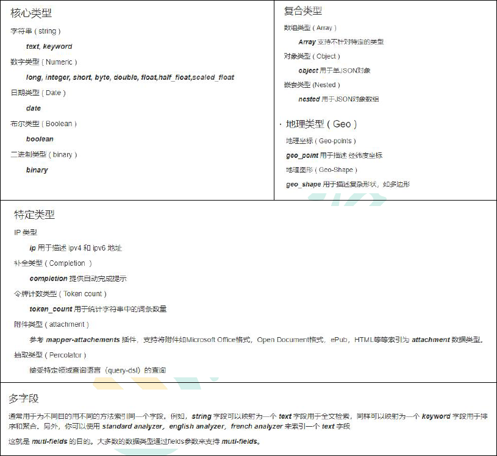

# 第一章 基本概念

Elastic可以快速地储存、搜索和分析海量数据。

官方文档：https://www.elastic.co/guide/en/elasticsearch/reference/current/index.html

```

```

**1、Index（索引）**

动词：相当于mysql中的insert

名词：相当于mysql中的database

**2、Type（类型）**

在index中，可以定义一个或者多个类型；相当于在mysql中的table，每一种类型的数据放在一起

**3、Document（文档）**

保存在某个索引下，某种类型的一个数据（Document），文档是json格式的，document就像是mysql中的某个table里面的内容；

**elastic的检索功能得益于倒排索引机制**

**4、后续版本更新变化**

- 关系型数据库中的两个数据表示是独立的，即使他们里面有相同名称的列也不影响使用，但是在ES中不是这样的。ES是基于Lucene开发的搜索引擎，而ES中不同type下名称相同的filed最终在Lucene中的处理方式是一样的。
  - 两个不同type下的两个user_name，在ES同一个索引下其实被认为是同一个filed，你必须在两个不同的type中定义相同的filed映射。否则不同type中的相同字段名称就会在处理中出现冲突的情况，导致Lucene处理效率下降
  - 去掉type就是为了提高ES处理数据的效率。
- ES 7.x：URL中的type参数可选。比如索引一个文档不再要求提供文档类型
- ES 8.x：不再支持URL中的type参数
- 解决：将索引从多类型迁移到单类型，每种类型文档一个独立索引。

# 第二章 基础知识

## 2.1 _cat

GET /_cat/nodes：查看所有节点

GET /_cat/health：查看es健康状况

GET /_cat/master：查看主节点

GET /_cat/indices：查看所有索引 相当于show databases

## 2.2 索引一个文档（保存）

在customer索引下的external类型下保存1号数据为...

```json
PUT customer/external/1
{
    "name":"John Doe"
}
```

PUT和POST都可以

- POST新增。如果不指定id，会自动生成id。指定id就会修改这个数据，并新增版本号
- PUT可以新增可以修改。PUT必须指定id，因此一般用来做修改操作。不指定id会报错

## 2.3 查询文档

GET customer/external/1

```json
{
  "_index" : "customer", // 在哪个索引
  "_type" : "external", // 在哪个类型
  "_id" : "1", // 记录id
  "_version" : 1, // 版本号
  "_seq_no" : 0, // 并发控制字段，每次更新就会+1，用来做乐观锁
  "_primary_term" : 1, // 同上，主分片重写分配，如果重启就会变化
  "found" : true, 
  "_source" : { // 真正的内容
    "name" : "John Doe"
  }
}
```

## 2.4 更新文档

```json
POST customer/external/1/_update
{
	"doc":{
        "name":"John Doew"
    }
}

// 或者
POST customer/external/1
{
    "name":"John Doew"
}

// 或者
PUT customer/external/1
{
    "name":"John Doew"
}
```

POST操作会对比源文档数据，如果相同就不会有什么操作，文档version不会增加；PUT操作总会将数据重新保存并增加version版本

带_update对比元数据如果一样就不进行任何操作

对于大并发更新不带update，对于大并发查询偶尔更新，带update；对比更新，重新计算分配规则

也可以更新的同时添加属性

```json
POST customer/external/1/_update
{
    "doc":{
        "name":"Jane Doe",
        "age":20
    }
}
```

## 2.5 删除文档&索引

DELETE customer/external/1

DELETE customer

## 2.6 bulk批量API

```json
POST customer/external/_bulk
{"index":{"_id":"1"}}
{"name": "John Doe" }
{"index":{"_id":"2"}}
{"name": "Jane Doe" }
```

bulk API以此顺序执行所有的action。如果一个单个的动作因任何原因而失败，它将继续处理它后面剩余的动作。当bulk API返回时，它将提供每个动作的状态（与发送顺序相同），所以可以检查有一个指定的动作是否失败了。

# 第三章 进阶检索

首先需要导入相应的json数据，就在当前md文件的同级目录下；

POST /blank/account/_bulk

## 3.1 Search API

ES支持两种基本方式检索：

- 通过使用REST request URI 发送搜索参数（uri + 检索参数）
- 通过使用REST request body 来发送它们2（uri + 请求体）

```json
GET blank/_search
{
  "query": {
    "match_all": {}
  },
  "sort": [
    {
      "account_number": {
        "order": "desc"
      }
    }
  ]
}
```

响应结果分析：

took：ES执行搜索的时间（毫秒）

time_out：告诉我们搜索是否超时

_shards：告诉我们多少个分片被搜索了，以及统计了成功/失败的搜索分片

hits：搜索结果

hits.total：搜索结果

hits.hits：实际的搜索结果数组（默认为前10的文档）

## 3.2 Query DSL

### 3.2.1 基本语法格式

ES提供了一个可以执行查询的json风格的DSL。被称为Query DSL。

- 一个查询语句的典型结构

  ```json
  {
      QUERY_NAME:{
          ARGUMENT:VALUE,
          ARGUMENT:VALUE,...
      }
  }
  ```

- 如果是针对某个字段，那么它的结构为：

  ```json
  {
      QUERY_NAME:{
          FIELD_NAME:{
              ARGUMENT:VALUE,
              ARGUMENT:VALUE,...
          }
      }
  }
  ```

### 3.2.2 返回部分字段

```json
GET blank/_search
{
  "query": {
    "match_all": {}
  },
  "from": 0,
  "size": 5,
  "_source": ["age", "balance"]
}
```

这样就只会显示数据的age和balance字段

### 3.2.3 match【匹配查询】

```json
GET blank/_search
{
    "query": {
        "match": {
            "account_number": "20"
        }
    }
}
```

可以对基本类型数据（非字符串）进行精确匹配；对于字符串来说是全文检索，并且每条记录都会有相关性得分。对于字符串类型来说，也可以匹配多个单词，比如："address" :"mill road"，最终查询出address中包含mill或者road或者mill road的所有记录，并给出相关性得分。

### 3.2.4 match_phrase【短语匹配】

比如"address":"mill road"，就会查出address中包含了mill road的记录，也就是说将其看作是一个整体。

### 3.2.5 multi_match【多字段匹配】

```json
GET bank/_search
{
    "query": {
        "multi_match": {
            "query": "mill",
            "fields": ["state","address"]
        }
    }
}
```

查询state或者address中包含了mill的记录

### 3.2.6 bool【复合查询】

bool用来做复合查询：复合语句可以合并任何其他查询语句，了解这一点是很重要的。这就意味着复合语句之间可以相互嵌套，可以表达非常复杂的逻辑

**must：必须达到must列举的所有条件**

```json
GET blank/_search
{
    "query": {
        "bool": {
            "must": [
                { "match": { "address": "mill" } },
                { "match": { "gender": "M" } }
            ]
        }
    }
}
```

**should：应该达到should列举的条件，如果达到会增加相关文档的评分，并不会改变查询的结果。如果query中只有should且只有一种匹配规则，那么should的条件就会被作为默认匹配条件而去改变查询结果。**

```json
GET blank/_search
{
    "query": {
        "bool": {
            "must": [
                { "match": { "address": "mill" } },
                { "match": { "gender": "M" } }
            ],
            "should": [
                {"match": { "address": "lane" }}
            ]
        }
    }
}
```

**must_not：必须不是指定的情况**

### 3.2.7 filter【结果过滤】

并不是所有的查询都需要产生分数，特别是那些仅用于"filtering"（过滤）的文档。为了不计算分数ES会自动检查场景并优化查询的执行

```json
GET bank/_search
{
    "query": {
        "bool": {
            "must": [
                {"match": { "address": "mill"}}
            ],
            "filter": {
                "range": {
                    "balance": {
                        "gte": 10000,
                        "lte": 20000
                    }
                }
            }
        }
    }
}
```

### 3.2.8 term

**和match一样，匹配某个属性的值。全文检索字段用match，其他非text字段用term**

```json
GET bank/_search
{
    "query": {
        "bool": {
            "must": [
                {"term": {
                    "age": {
                        "value": "28"
                    }
                }},
                {"match": {
                    "address": "990 Mill Road"
                }}
            ]
        }
    }
}
```

### 3.2.9 aggregations（执行聚合）

聚合提供了从数据中分组和提取数据的能力。在ES中，你有执行搜索返回hits（命中结果），并且同时返回聚合结果，把一个响应中的所有hits（命中结果）分隔开的能力。也可以执行查询和多个聚合，并且在一次使用中得到各自的（任何一个的）返回结果，使用一次简洁和简化的API来避免网络往返。

**搜索address中包含mill的所有人的年龄分布以及平均年龄，但不显示这些人的详情**

```json
GET blank/_search
{
    "query":{
        "match":{
            "address":"mill"
        }
    },
    "aggs":{ // 执行聚合
        "group_by_state":{ // 这次聚合的名字
            "terms":{ // 聚合的类型
                "field":"age"
            }
        },
        "avg_age":{
            "avg":{
                "field":"age"
            }
        }
    },
    "size":0 // 不显示搜索数据
}
```

**按照年龄聚合，并且请求这些年龄段的这些人的平均薪资**

```json
GET blank/account/_search
{
    "query":{
        "match_all":{}
    },
    "aggs":{
        "age_avg":{
            "terms":{
                "field":"age"
            },
            "aggs":{
                "balances_avg":{
                    "avg":{
                        "field":"balance"
                    }
                }
            }
        }
    }
}
```

**查出所有年龄分布，并且这些年龄段中M的平均薪资和F的平均薪资以及这个年龄段的总体平均薪资**

```json
GET blank/account/_search
{
    "query": {
        "match_all": {}
    },
    "aggs": {
        "age_agg": {
            "terms": {
                "field": "age",
                "size": 100
            },
            "aggs": {
                "gender_agg": {
                    "terms": {
                        "field": "gender.keyword",
                        "size": 100
                    },
                    "aggs": {
                        "balance_avg": {
                            "avg": {
                                "field": "balance"
                            }
                        }
                    }
                },
                "balance_avg":{
                    "avg": {
                        "field": "balance"
                    }
                }
            }
        }
    }
    ,
    "size": 1000
}
```

## 3.3 Mapping

### 3.3.1 字段类型



### 3.3.2 映射

Mapping是用来定义一个文档，以及它所包含的属性是如何存储和索引的。比如使用mapping来定义：

- 哪些字符串属性应该被看做全文属性（full text fields）
- 哪些属性包含数字，日期或者地理位置。
- 文档中的所有属性是否都能被索引（_all配置）
- 日期的格式
- 自定义映射规则来执行动态添加属性

**查看mapping的信息**：GET blank/_mapping

**修改mapping信息**：[Mapping | Elasticsearch Guide [7.15\] | Elastic](https://www.elastic.co/guide/en/elasticsearch/reference/current/mapping.html)

### 3.3.3 新版本的变化

ES8不再支持URL中的type，

解决：

1. 将索引从多类型迁移到单类型，每种类型文档一个独立索引
2. 将已存在的索引下的类型数据，全部迁移到指定位置即可。

**1、创建映射**

```json
PUT /my-index
{
    "mappings": {
        "properties": {
            "age": { "type": "integer" },
            "email": { "type": "keyword" },
            "name": { "type": "text" }
        }
    }
}
```

**2、添加新的字段映射**

```json
PUT /my-index/_mapping
{
    "properties": {
        "employee-id": {
            "type": "keyword",
            "index": false
        }
    }
}
```

**3、更新映射**

对于已经存在的映射字段，我们不能更新。更新必须创建新的索引进行数据迁移

**4、数据迁移**

```json
// 先创建出new-index的正确映射
POST _reindex
{
    "source":{
        "index":"my-index"
    },
    "dest":{
        "index":"new-index"
    }
}
// 将旧索引的type下的数据进行迁移
POST _reindex
{
    "source":{
        "index":"my-index",
        "type":"index-type"
    },
    "dest":{
        "index":"new-index"
    }
}
```

## 3.4 分词

一个**tokenizer**（分词器）接收一个字符流，将之分割为独立的**tokens**（词元，通常是独立的单词），然后输出**tokens** 流。例如，whitespace **tokenizer** 遇到空白字符时分割文本。它会将文本"**Quick brown fox!**" 分割为[**Quick, brown, fox!**]。该**tokenizer**（分词器）还负责记录各个**term**（词条）的顺序或**position** 位置（用于**phrase** 短语和**word** **proximity** 词近邻查询），以及**term**（词条）所代表的原始**word**（单词）的**start**（起始）和**end**（结束）的**character offsets**（字符偏移量）（用于高亮显示搜索的内容）。**Elasticsearch** 提供了很多内置的分词器，可以用来构建**custom analyzers**（自定义分词器）。

安装ik分词器的过程见Docker.md文件中相关笔记内容

# 第四章 ElasticSearch-Rest-Client

https://www.elastic.co/guide/en/elasticsearch/client/java-rest/current/java-rest-high.html

**1、导入相关依赖**

```xml
<dependency>
    <groupId>org.elasticsearch.client</groupId>
    <artifactId>elasticsearch-rest-high-level-client</artifactId>
    <version>7.4.2</version>
</dependency>
```

```xml
springboot默认整合了es6，需要将其改为es7
<properties>
    <elasticsearch.version>7.4.2</elasticsearch.version>
</properties>
```

**2、编写配置类**

```java
@Configuration
public class GulimailElasticSearchConfig {

    public static final RequestOptions COMMON_OPTIONS;
    static {
        RequestOptions.Builder builder=RequestOptions.DEFAULT.toBuilder();
        // 在里面添加一些需求
        COMMON_OPTIONS=builder.build();
    }

    @Bean
    public RestHighLevelClient esRestClient(){
        RestHighLevelClient client=new RestHighLevelClient(
                RestClient.builder(new HttpHost("192.168.118.128",9200,"http"))
        );
        return client;
    }
}
```

**3、测试**

```java
@Test
void contextLoads() throws IOException {
    IndexRequest indexRequest = new IndexRequest("users");
    indexRequest.id("1"); // 数据的id
    User user = new User();
    user.setAge(18);
    user.setGender("男");
    user.setUsername("ZhangSan");
    String jsonString = JSON.toJSONString(user);
    indexRequest.source(jsonString, XContentType.JSON);

    // 执行操作
    IndexResponse indexResponse = client.index(indexRequest, GulimailElasticSearchConfig.COMMON_OPTIONS);
}
```

```java
@Test
void test() throws IOException {
    // 1、创建检索请求
    SearchRequest searchRequest = new SearchRequest();
    // 指定索引
    searchRequest.indices("blank");
    // 指定DSL检索条件
    SearchSourceBuilder searchSourceBuilder = new SearchSourceBuilder();
    // 构建检索条件
    //        searchSourceBuilder.query();
    //        searchSourceBuilder.aggregation();
    // 根据业务需求自行构建
    searchRequest.source(searchSourceBuilder);

    // 2、执行检索
    SearchResponse searchResponse = client.search(searchRequest, GulimailElasticSearchConfig.COMMON_OPTIONS);
    // 3、分析结果
    SearchHits searchHits = searchResponse.getHits(); // 最外层的hits
    SearchHit[] hits = searchHits.getHits(); // 真正的数据
    // 。。。。根据业务需求进行分析
}
```

