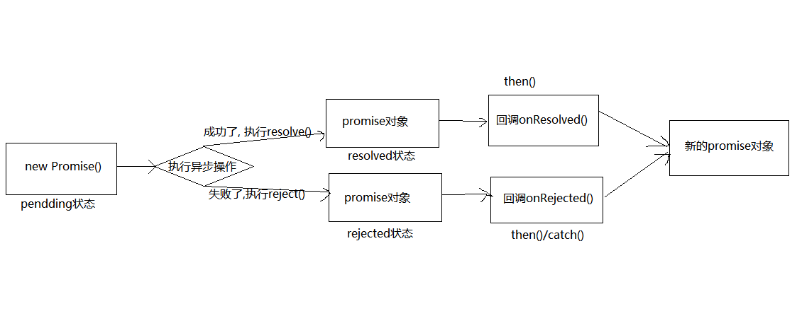

# 第一章、Promise的理解和使用

## 1.1 什么是Promise

1. Promise是一门新的技术，它是JS中进行异步编程的新解决方案。
2. 从语法上来说，Promise是一个构造函数
3. 从功能上来说，Promise对象用来封装一个异步操作并可以获取其成功/失败的结果值
4. Primise主要用来解决回调地狱的问题


## 1.2 Promise的状态改变和基本流程

Promise具有三种状态，pending、resolved、rejected。

有两种状态改变：

1. pending变为resolved
2. pending变成rejected
3. 只有这两种，且一个promise对象只能改变一次。无论变成成功还是失败，都会有一个结果数据。成功的结果数据一般称为value，失败的结果数据一般称为reason



## 1.3 为什么要用Promise

1. 指定回调函数的方式更加灵活
   - 旧的：必须在启动异步任务之前指定
   - promise：启动异步任务 => 返回promise对象 => 给promise对象绑定回调函数（甚至可以在异步任务结束后指定多个）
2. 支持链式调用，可以解决回调地狱问题
   - 回调地狱就是回调函数嵌套调用，外部回调函数异步执行的结果是嵌套的回调执行的条件。
   - 缺点：不便于阅读，不便于进行进行异常处理

```js
<script>
    // 成功的回调函数 
    function successCallback(result) {
    console.log("声音文件创建成功: " + result);
	} 
	// 失败的回调函数 
	function failureCallback(error) { 
   		console.log("声音文件创建失败: " + error); 
	} 
	/* 1.1 使用纯回调函数 */ 
	createAudioFileAsync(audioSettings, successCallback, failureCallback);

	/* 1.2. 使用Promise */ 
	const promise = createAudioFileAsync(audioSettings);
	setTimeout(() => {
    	promise.then(successCallback, failureCallback); 
	}, 3000);
	/* 2.1. 回调地狱 */ 
	doSomething(function(result){
        doSomethingElse(result, function(newResult) { 
        	doThirdThing(newResult, function(finalResult) { 
            	console.log('Got the final result: ' + finalResult)
            }, failureCallback) 
        }, failureCallback)
    }, failureCallback) 
	/* 2.2. 使用promise的链式调用解决回调地狱 */
	doSomething().then(function(result) { 
    	return doSomethingElse(result)
	})
    .then(function(newResult) {
    	return doThirdThing(newResult) 
		})
    .then(function(finalResult) { 
    	console.log('Got the final result: ' + finalResult) 
		}) 
    .catch(failureCallback)
	/* 2.3. async/await: 回调地狱的终极解决方案 */ 
	async function request() {
    	try {
        	const result = await doSomething()
        	const newResult = await doSomethingElse(result) 
        	const finalResult = await doThirdThing(newResult)
        	console.log('Got the final result: ' + finalResult)
    	} catch (error) {
        	failureCallback(error) 
    	} 
	}
</script>
```

# 第二章、API

## 2.1 then和catch

指定用于得到成功value的成功回调和用于得到失败reason的失败回调，并返回一个新的promise对象

```js
let p = new Promise((resolve, reject) => {
    reject('error');
});

// then可以写失败回调也可以不写
p.then(value => {
    alert(value);
}, reason => {
    alert(reason);
});

// then的语法糖，相当于then(undefined, onRejected)
p.catch(reason => {
    console.log(reason); //会输出error
})
```

## 2.2 resolve

```js
let p1 = Promise.resolve(521);
// 如果传入的参数是非Promise类型的对象，则返回的结果为成功promise对象
// 如果传入的参数为Promise对象，则参数的结果决定了resolve的结果
let p2 = Promise.resolve(new Promise((resolve, reject) => {
    reject('error')
}));
// 返回的p2是一个失败的promise，因此会执行catch
p2.catch(reason => {
    console.log(reason);
})
```

## 2.3 reject

无论传入的是什么，都将返回一个失败的promise对象

```js
let p3 = Promise.reject(new Promise((resolve, reject) => {
    resolve('OK');
}));

console.log(p3);
```

## 2.4 all

返回一个新的promise，只有所有的promise都成功才成功，只要有一个失败了就直接失败

```js
let p1 = new Promise((resolve, reject) => {
    resolve('OK');
})
// let p2 = Promise.resolve('Success');
let p2 = Promise.reject('Error');
let p3 = Promise.resolve('Oh Yeah');

const result = Promise.all([p1, p2, p3]);

console.log(result);
```

## 2.5 race

返回一个新的promise，第一个完成的promise的结果状态就是最终的结果状态

```js
let p1 = new Promise((resolve, reject) => {
    setTimeout(() => {
        resolve('OK');
    }, 1000);
})
let p2 = Promise.resolve('Success');
let p3 = Promise.resolve('Oh Yeah');

//调用
const result = Promise.race([p1, p2, p3]);

console.log(result);
```

# 第三章、几个关键问题

1. 如何改变promise的状态？

   - resolve(value)：如果当前是pending就会变成resolved
   - reject（reason）：如果当前是pending就会变成rejected
   - 抛出异常：如果当前是pending就会变成rejected

2. 一个promise指定多个成功/失败回调函数，都会调用吗？

   - 当promise改变为对应状态时都会调用

3. 改变promise状态和**指定**（不是执行）回调函数谁先谁后？

   - 都有可能，正常情况下是先指定回调再改变状态，但是也可以先改变状态再指定回调
   - 如何先改变状态再指定回调？
     1. 在执行器中直接调用resolve/rejecte
     2. 延迟更长时间才调用then
   - 什么时候才能得到数据？
     - 如果先指定的回调，那当状态发生改变时，回调函数就会调用，得到数据
     - 如果先改变的状态，那当指定回调时，回调函数就会调用，得到数据

4. promise.then返回的新promise的结果状态由什么决定？

   1. 简单表达 : 由 then()指定的回调函数执行的结果决定
   2. 详细表达 :
      ① 如果抛出异常 , 新 promise变为 rejected, reason为抛出的异常
      ② 如果返回的是非 promise的任意值 , 新 promise变为 resolved, value为返回的值
      ③ 如果返回的是另一个新 promise, 此 promise的结果就会成为新 promise的结果

5. promise如何串联多个操作任务？

   1. 通过then的链式调用

6. promise异常穿透？

   1. 当使用promise的链式调用时，可以在最后指定失败的回调
   2. 前面任何操作出了问题，都会传到最后失败的回调中处理

7. 中断promise链？

   1. 当使用promise的then链式调用时，在中间中断，不再调用后面的回调函数

   2. 办法：再回调函数中返回一个pedding状态的promise对象

      ```js
      let p = new Promise((resolve, reject) => {
          setTimeout(() => {
              resolve('OK');
          }, 1000);
      });
      
      p.then(value => {
          console.log(111);
          //有且只有一个方式
          return new Promise(() => {});
      }).then(value => {
          console.log(222);
      }).then(value => {
          console.log(333);
      }).catch(reason => {
          console.warn(reason);
      });
      ```

# 第四章、async和await

**1、async函数**

- 函数的返回值为promise对象
- promise对象的结果由async函数执行的返回值决定

**2、await表达式**

- await右侧的表达式一般为promise对象，但也可以是其他的值
- 如果表达式是promise对象，await返回的是promise成功的值
- 如果是其他值，直接将此值作为await的返回值

**3、注意**

- await必须写在async函数中，但async函数中可以没有await
- 如果await的promise失败了，就会抛出异常，通过try catch捕获

```js
async function test() { 
    try {
        const result2 = await fn() 
        console.log('result2', result2) 
    } catch (error) {
        console.log('error', error)
    } 
    const result3 = await fn4()
    console.log('result4', result3) 
}
```

