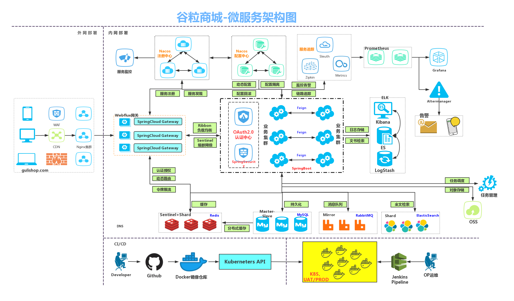

# 微服务架构图



# 快速开发

www.gitee.com/renrenio中的renren-fast、renren-fast-vue、renren-generator等开源项目来快速构建我们的后台管理系统

**renrenfast使用步骤：**

1. 将renren-fast导入进我们的谷粒商城项目中，并且在父工程的pom文件中进行配置。
2. 创建renren-fast内部的db数据表，并修改它的配置文件

**renren-generator使用步骤**

1. 修改application.yml文件中的mysql地址

2. 修改generator.properties属性文件中的属性

   mainPath、package、moduleName、author、email、tablePrefix（表前缀，如果相应的数据库中的表都写了对应的表名的话，就会省略掉表名）等等

3. 由于renren里面默认使用的shiro，就可以通过该模块里面的tempate/Controller.java.vm进行修改，将shiro相关的内容都给注释或者删掉。

4. 运行该项目后打开80端口，操作后生成一个压缩包，里面有基本的mybatis文件和controller、service、dao、entity，还有配合renren-fast-vue使用的vue文件

5. 注意的是生成的文件里面用的是shiro安全框架，而且还需要导入一些依赖

6. 从renren-fast模块中将对应缺失的类给放入gulimall-common中

# 整合mybatis-plus

1、引入依赖

2、配置

```yaml
spring:
  datasource:
    username: root
    password: DLF121566
    url: jdbc:mysql://localhost/gulimail_pms?serverTimezone=GMT%2B8&characterEncoding=utf-8
    driver-class-name: com.mysql.cj.jdbc.Driver
    
    
mybatis-plus:
  mapper-locations: classpath:/mapper/**/*.xml
  global-config:
    db-config:
      id-type: auto
      logic-delete-value: 1
      logic-not-delete-value: 0
```

3、@MapperScan("com.atguigu.gulimail.product.dao")

4、开启事务注解：@EnableTransactionManagement

# Nacos作微服务注册中心

1. 启动nacos

2. 引入依赖

   ```xml
   <!--        服务注册/发现-->
   <dependency>
       <groupId>com.alibaba.cloud</groupId>
       <artifactId>spring-cloud-starter-alibaba-nacos-discovery</artifactId>
   </dependency>
   ```

3. 配置文件：`spring.cloud.nacos.discovery.server-addr=localhost:8848`

4. `@EnableDiscoveryClient`：开启服务的发现和注册功能

5. 在每个服务写上该服务的名字`spring.application.name=gulimall-product`

6. 登录localhost:8848/nacos

# OpenFeign

1. 引入依赖

   ```xml
   <dependency>
       <groupId>org.springframework.cloud</groupId>
       <artifactId>spring-cloud-starter-openfeign</artifactId>
   </dependency>
   ```

2. 开启feign功能`@EnableFeignClients(basePackages="com.atguigu.gulimall.pms.feign")`

3. 声明远程接口

   ```java
   @FeignClient("gulimall-ware")
   public interface WareFeignService {
       @PostMapping("/ware/waresku/skus")
       public Resp<List<SkuStockVo>> skuWareInfos(@RequestBody List<Long> skuIds);
   }
   ```

   当执行wareFeignService中的该方法的时候，该服务会从注册中心中找到gulimall-ware服务中的/ware/waresku/skus对应的方法，并进行调用

# Nacos作配置中心

```xml
<!--        配置中心来做配置管理-->
<dependency>
    <groupId>com.alibaba.cloud</groupId>
    <artifactId>spring-cloud-starter-alibaba-nacos-config</artifactId>
</dependency>
```

创建bootstrap.properties文件，并进行相关配置

```
spring.application.name=gulimail-gateway
spring.cloud.nacos.config.server-addr=localhost:8848
```

然后给配置中心默认添加一个数据集（Data Id），默认命名规则：应用名.properties

可以添加@RefreshScope表示动态获取并刷新配置，@Value：获取配置

# Gateway

当我们发送请求的时候，可以先发给网关，然后再由网关转交给其余的微服务

```yaml
spring:
  cloud:
    gateway:
      routes:
        - id: coupon_route
          uri: lb://gulimail-coupon
          predicates:
            - Path=/api/coupon/**
          filters:
            - RewritePath=/api/(?<segment>.*),/$\{segment}

        - id: admin_route
          uri: lb://renren-fast
          predicates:
            - Path=/api/**
          filters:
            - RewritePath=/api/(?<segment>.*),/renren-fast/$\{segment}
```

例如上面的配置，如果发现请求的路径是/api/**（匹配顺序由上至下，发现不是coupon服务的就会转交给renren-fast），就将请求负载均衡到renren-fast服务中，并且进行路径的重写，比如：localhost:88/api/cart就变成了localhost:88/renren-fast/cart

而且还可以在gateway中配置跨域请求

```java
@Configuration
public class CorsConfig {
    @Bean
    public CorsWebFilter corsFilter() {
        CorsConfiguration config = new CorsConfiguration();
        config.setAllowCredentials(true); //是否允许携带cookie
        config.addAllowedOrigin("*"); //可接受的域，是一个具体域名或者*（代表任意域名）
        config.addAllowedHeader("*"); //允许携带的头
        config.addAllowedMethod("*"); //允许访问的方式

        UrlBasedCorsConfigurationSource source = new UrlBasedCorsConfigurationSource();
        source.registerCorsConfiguration("/**", config);

        return new CorsWebFilter(source);
    }
}
```

