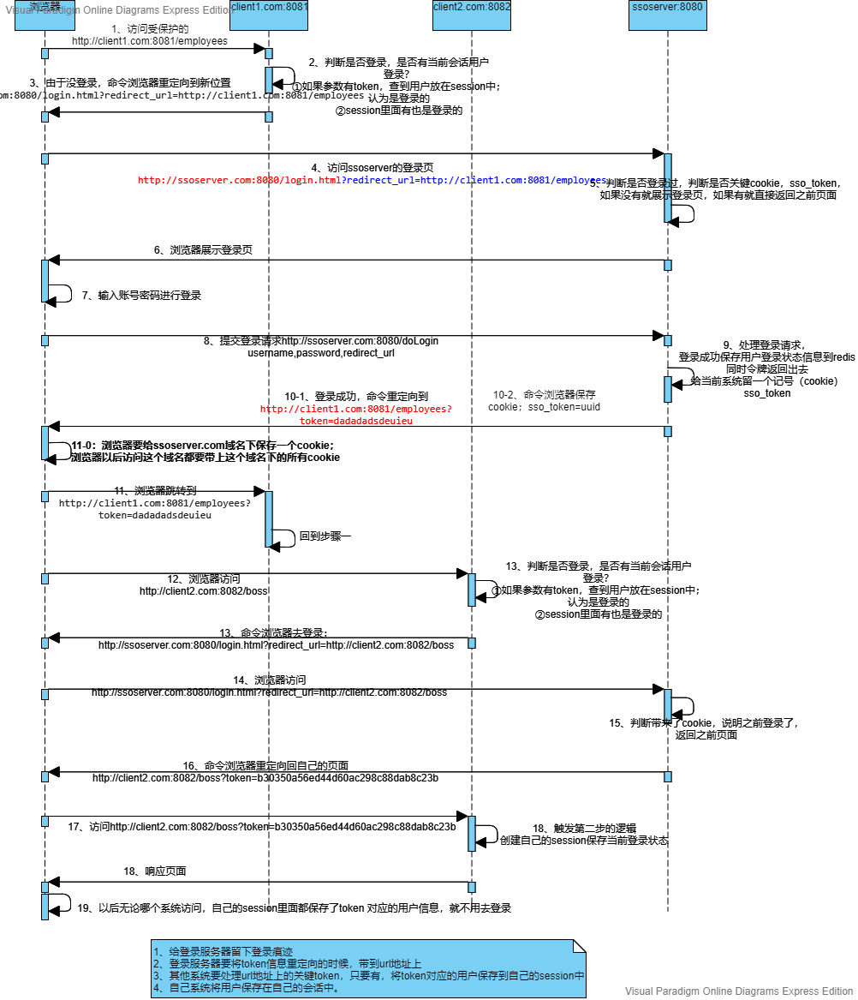

# 1、短信发送

对于短信发送来说，一定要注意接口防刷，因为即使在前端设置了60秒之后才能发送短信，但是如果用户直接刷新该页面，或者将该js给禁掉，就可以无限的发送短信了，就会造成浪费等。

在redis中存储验证码的时候，可以在后面拼接上当前的时间戳，然后在每次验证的时候都看一下当前的时间戳是否和验证码中的时间戳差隔60秒，只有超过了60秒才能再次发送验证码。

至于具体的短信发送流程，可以用阿里云的短信服务。

# 2、加密处理

**MD5**：Message Digest algorithm 5，信息摘要算法

- 压缩性：任意长度的数据，算出的MD5值的长度都是固定的
- 容易计算：从原数据计算出MD5值很容易
- 抗修改性：对原数据进行任何改动，哪怕只修改1个字节，所得到的MD5值都有很大区别
- 强抗碰撞：想找到两个不同的数据，使他们具有相同的MD5值，是非常困难的
- 不可逆：但是正是由于MD5的不可逆性，有些人就可以根据一个彩虹表，直接在表中查出MD5对应的原数据，因此不太安全。

**加盐**

- 通过生成随机数与MD5生成字符串进行组合
- 数据库同时存储MD5值和salt值，验证正确性时使用salt进行MD5即可。
- 但是这样数据库还得额外存储一份salt值

**BCryptPasswordEncoder**：SpringBoot专门为我们提供了该加密类，更安全可靠。

# 3、Gitee社交登录

官方文档：[Gitee OAuth 文档](https://gitee.com/api/v5/oauth_doc#/)

社交登录流程：


如图所示，浏览器在点击社交登录按钮的时候，将请求发送给gitee认证服务器，同时携带上**client_id**和**redirect_uri**

```
https://gitee.com/oauth/authorize?client_id={client_id}
&redirect_uri=http://auth.gulimall.com/oauth2.0/gitee/success
&response_type=code
```

然后就会跳转到gitee的登录页面，登录成功后，就会根据设定好的**redirect_uri**跳转到我们自己的服务器，并且会带上生成好的**code**。

接着就可以在自己的应用服务器中拿到该**code**，然后根据应用的**ClientID**和**Client Secret**等获取到该用户的**access_token**，应用通过 **access_token** 访问 Open API 使用用户数据。

`https://gitee.com/oauth/token?grant_type=authorization_code&code={code}&client_id={client_id}&redirect_uri={redirect_uri}&client_secret={client_secret}`：使用该POST请求获取到**access_token**。

在自己的应用服务器中发送http请求，就可以使用到httputils，并且需要导入相关依赖，地址如下：

httputils：https://github.com/aliyun/api-gateway-demo-sign-java/blob/master/pom.xml

然后导入该工具类（放在本笔记的最后）

对于应用来说，我们使用社交登录的时候，首先得判断该用户是否是第一次登录，如果是第一次登录，就得处理对应的注册流程。


# 4、单点登录

所谓的单点登录，就是用户在不用的域名下（不是子域名），一次登录，处处登录。例如：用户在a.com登录了，b.com和c.com也会自动同步登录了。

我们以认证服务器ssoserver.com、客户服务器client1.com、服务器client2.com为例进行讲解



# 5、HttpUtils

示例：

```java
Map<String, String> query = new HashMap<>();//用于封装查询参数的
query.put("access_token", socialUser.getAccess_token());
HttpResponse response = HttpUtils.doGet("https://gitee.com", "/api/v5/user", "get", new HashMap<String, String>(), query);
```


```xml
<dependencies>
    <dependency>
        <groupId>com.alibaba</groupId>
        <artifactId>fastjson</artifactId>
        <version>1.2.15</version>
    </dependency>
    <dependency>
        <groupId>org.apache.httpcomponents</groupId>
        <artifactId>httpclient</artifactId>
        <version>4.2.1</version>
    </dependency>
    <dependency>
        <groupId>org.apache.httpcomponents</groupId>
        <artifactId>httpcore</artifactId>
        <version>4.2.1</version>
    </dependency>
    <dependency>
        <groupId>commons-lang</groupId>
        <artifactId>commons-lang</artifactId>
        <version>2.6</version>
    </dependency>
    <dependency>
        <groupId>org.eclipse.jetty</groupId>
        <artifactId>jetty-util</artifactId>
        <version>9.3.7.v20160115</version>
    </dependency>
</dependencies>
```


```java
import org.apache.commons.lang.StringUtils;
import org.apache.http.HttpResponse;
import org.apache.http.NameValuePair;
import org.apache.http.client.HttpClient;
import org.apache.http.client.entity.UrlEncodedFormEntity;
import org.apache.http.client.methods.HttpDelete;
import org.apache.http.client.methods.HttpGet;
import org.apache.http.client.methods.HttpPost;
import org.apache.http.client.methods.HttpPut;
import org.apache.http.conn.ClientConnectionManager;
import org.apache.http.conn.scheme.Scheme;
import org.apache.http.conn.scheme.SchemeRegistry;
import org.apache.http.conn.ssl.SSLSocketFactory;
import org.apache.http.entity.ByteArrayEntity;
import org.apache.http.entity.StringEntity;
import org.apache.http.impl.client.DefaultHttpClient;
import org.apache.http.message.BasicNameValuePair;

import javax.net.ssl.SSLContext;
import javax.net.ssl.TrustManager;
import javax.net.ssl.X509TrustManager;
import java.io.UnsupportedEncodingException;
import java.net.URLEncoder;
import java.security.KeyManagementException;
import java.security.NoSuchAlgorithmException;
import java.security.cert.X509Certificate;
import java.util.ArrayList;
import java.util.List;
import java.util.Map;

public class HttpUtils {

    /**
     * get
     *
     * @param host
     * @param path
     * @param method
     * @param headers
     * @param querys
     * @return
     * @throws Exception
     */
    public static HttpResponse doGet(String host, String path, String method,
                                     Map<String, String> headers,
                                     Map<String, String> querys)
        throws Exception {
        HttpClient httpClient = wrapClient(host);

        HttpGet request = new HttpGet(buildUrl(host, path, querys));
        for (Map.Entry<String, String> e : headers.entrySet()) {
            request.addHeader(e.getKey(), e.getValue());
        }

        return httpClient.execute(request);
    }

    /**
     * post form
     *
     * @param host
     * @param path
     * @param method
     * @param headers
     * @param querys
     * @param bodys
     * @return
     * @throws Exception
     */
    public static HttpResponse doPost(String host, String path, String method,
                                      Map<String, String> headers,
                                      Map<String, String> querys,
                                      Map<String, String> bodys)
        throws Exception {
        HttpClient httpClient = wrapClient(host);

        HttpPost request = new HttpPost(buildUrl(host, path, querys));
        for (Map.Entry<String, String> e : headers.entrySet()) {
            request.addHeader(e.getKey(), e.getValue());
        }

        if (bodys != null) {
            List<NameValuePair> nameValuePairList = new ArrayList<NameValuePair>();

            for (String key : bodys.keySet()) {
                nameValuePairList.add(new BasicNameValuePair(key, bodys.get(key)));
            }
            UrlEncodedFormEntity formEntity = new UrlEncodedFormEntity(nameValuePairList, "utf-8");
            formEntity.setContentType("application/x-www-form-urlencoded; charset=UTF-8");
            request.setEntity(formEntity);
        }

        return httpClient.execute(request);
    }

    /**
     * Post String
     *
     * @param host
     * @param path
     * @param method
     * @param headers
     * @param querys
     * @param body
     * @return
     * @throws Exception
     */
    public static HttpResponse doPost(String host, String path, String method,
                                      Map<String, String> headers,
                                      Map<String, String> querys,
                                      String body)
        throws Exception {
        HttpClient httpClient = wrapClient(host);

        HttpPost request = new HttpPost(buildUrl(host, path, querys));
        for (Map.Entry<String, String> e : headers.entrySet()) {
            request.addHeader(e.getKey(), e.getValue());
        }

        if (StringUtils.isNotBlank(body)) {
            request.setEntity(new StringEntity(body, "utf-8"));
        }

        return httpClient.execute(request);
    }

    /**
     * Post stream
     *
     * @param host
     * @param path
     * @param method
     * @param headers
     * @param querys
     * @param body
     * @return
     * @throws Exception
     */
    public static HttpResponse doPost(String host, String path, String method,
                                      Map<String, String> headers,
                                      Map<String, String> querys,
                                      byte[] body)
        throws Exception {
        HttpClient httpClient = wrapClient(host);

        HttpPost request = new HttpPost(buildUrl(host, path, querys));
        for (Map.Entry<String, String> e : headers.entrySet()) {
            request.addHeader(e.getKey(), e.getValue());
        }

        if (body != null) {
            request.setEntity(new ByteArrayEntity(body));
        }

        return httpClient.execute(request);
    }

    /**
     * Put String
     * @param host
     * @param path
     * @param method
     * @param headers
     * @param querys
     * @param body
     * @return
     * @throws Exception
     */
    public static HttpResponse doPut(String host, String path, String method,
                                     Map<String, String> headers,
                                     Map<String, String> querys,
                                     String body)
        throws Exception {
        HttpClient httpClient = wrapClient(host);

        HttpPut request = new HttpPut(buildUrl(host, path, querys));
        for (Map.Entry<String, String> e : headers.entrySet()) {
            request.addHeader(e.getKey(), e.getValue());
        }

        if (StringUtils.isNotBlank(body)) {
            request.setEntity(new StringEntity(body, "utf-8"));
        }

        return httpClient.execute(request);
    }

    /**
     * Put stream
     * @param host
     * @param path
     * @param method
     * @param headers
     * @param querys
     * @param body
     * @return
     * @throws Exception
     */
    public static HttpResponse doPut(String host, String path, String method,
                                     Map<String, String> headers,
                                     Map<String, String> querys,
                                     byte[] body)
        throws Exception {
        HttpClient httpClient = wrapClient(host);

        HttpPut request = new HttpPut(buildUrl(host, path, querys));
        for (Map.Entry<String, String> e : headers.entrySet()) {
            request.addHeader(e.getKey(), e.getValue());
        }

        if (body != null) {
            request.setEntity(new ByteArrayEntity(body));
        }

        return httpClient.execute(request);
    }

    /**
     * Delete
     *
     * @param host
     * @param path
     * @param method
     * @param headers
     * @param querys
     * @return
     * @throws Exception
     */
    public static HttpResponse doDelete(String host, String path, String method,
                                        Map<String, String> headers,
                                        Map<String, String> querys)
        throws Exception {
        HttpClient httpClient = wrapClient(host);

        HttpDelete request = new HttpDelete(buildUrl(host, path, querys));
        for (Map.Entry<String, String> e : headers.entrySet()) {
            request.addHeader(e.getKey(), e.getValue());
        }

        return httpClient.execute(request);
    }

    private static String buildUrl(String host, String path, Map<String, String> querys) throws UnsupportedEncodingException {
        StringBuilder sbUrl = new StringBuilder();
        sbUrl.append(host);
        if (!StringUtils.isBlank(path)) {
            sbUrl.append(path);
        }
        if (null != querys) {
            StringBuilder sbQuery = new StringBuilder();
            for (Map.Entry<String, String> query : querys.entrySet()) {
                if (0 < sbQuery.length()) {
                    sbQuery.append("&");
                }
                if (StringUtils.isBlank(query.getKey()) && !StringUtils.isBlank(query.getValue())) {
                    sbQuery.append(query.getValue());
                }
                if (!StringUtils.isBlank(query.getKey())) {
                    sbQuery.append(query.getKey());
                    if (!StringUtils.isBlank(query.getValue())) {
                        sbQuery.append("=");
                        sbQuery.append(URLEncoder.encode(query.getValue(), "utf-8"));
                    }
                }
            }
            if (0 < sbQuery.length()) {
                sbUrl.append("?").append(sbQuery);
            }
        }

        return sbUrl.toString();
    }

    private static HttpClient wrapClient(String host) {
        HttpClient httpClient = new DefaultHttpClient();
        if (host.startsWith("https://")) {
            sslClient(httpClient);
        }

        return httpClient;
    }

    private static void sslClient(HttpClient httpClient) {
        try {
            SSLContext ctx = SSLContext.getInstance("TLS");
            X509TrustManager tm = new X509TrustManager() {
                public X509Certificate[] getAcceptedIssuers() {
                    return null;
                }
                public void checkClientTrusted(X509Certificate[] xcs, String str) {

                }
                public void checkServerTrusted(X509Certificate[] xcs, String str) {

                }
            };
            ctx.init(null, new TrustManager[] { tm }, null);
            SSLSocketFactory ssf = new SSLSocketFactory(ctx);
            ssf.setHostnameVerifier(SSLSocketFactory.ALLOW_ALL_HOSTNAME_VERIFIER);
            ClientConnectionManager ccm = httpClient.getConnectionManager();
            SchemeRegistry registry = ccm.getSchemeRegistry();
            registry.register(new Scheme("https", 443, ssf));
        } catch (KeyManagementException ex) {
            throw new RuntimeException(ex);
        } catch (NoSuchAlgorithmException ex) {
            throw new RuntimeException(ex);
        }
    }
}
```


